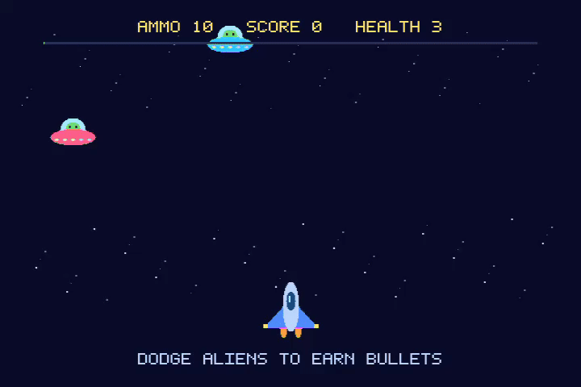

# Ashley's Fighter Jet — Xbox

An original Xbox homebrew adaptation of [Ashley’s Fighter Jet](https://github.com/ZacharyLeahan/ashleyfighterjet), the HTML5 game I made with my daughter Ashley. Written in C with the open-source nxdk SDK and SDL2, it brings our blue jet, scrolling stars, and colorful UFOs to Xbox controllers, with local cooperative play.



Gameplay recorded on an original Xbox through our [ESP-KVM fork](https://github.com/ZacharyLeahan/espkvm).

## Gameplay

Fly through a short, 24-alien level. Each pilot starts with 10 bullets and three health. Shooting an alien earns the shooter three points; letting one pass earns each surviving pilot one point and one bullet. Finish the wave to win.

Connect one controller for solo play or two for cooperative play. P1 flies the blue jet; P2 flies the pink jet. Both pilots share the same enemies, with separate scores, ammo, and health. Jets can overlap freely. If one pilot gets knocked out, the teammate can continue. The result screen compares their scores.

Controllers can connect or disconnect during play. Pilot stats are preserved within the run; if P1 disconnects, the remaining pilot becomes P1. Only two controllers participate.

| Control | Action |
| --- | --- |
| Left stick or D-pad | Move |
| A | Shoot |
| Start | Begin or restart the run |

## Code

The game uses a fixed 640 × 480 logical playfield and a 60 Hz simulation. Ships, aliens, stars, and a small bitmap font are drawn in code, without external art assets.

- [`src/game.c`](src/game.c) — platform-independent movement, waves, collisions, bullet ownership, scoring, and game states.
- [`src/game.h`](src/game.h) — shared game, player, entity, and input types.
- [`src/main.c`](src/main.c) — SDL initialization, controller discovery, input routing, and the fixed-step loop.
- [`src/render.c`](src/render.c) — original placeholder graphics, scrolling background, HUD, and result screens.
- [`tests/`](tests/) — solo/co-op gameplay tests and SDL controller integration tests.

This is a small playable adaptation. The current level has one enemy type and deterministic waves; sound, bosses, upgrades, and saved progress are future work.

## Build on macOS

```sh
brew install cmake coreutils llvm lld
./scripts/setup-nxdk.sh
./scripts/build.sh
```

nxdk is checked out separately at `~/Developer/toolchains/nxdk`; set `NXDK_DIR` to use another location. Its version is pinned in [`nxdk.lock`](nxdk.lock), with recursive submodules pinned by that SDK commit. The build uses a temporary directory to support workspace paths containing spaces.

Build outputs are written to ignored `build/`: `default.xbe`, `game.iso`, matching debug symbols, a build log, and SHA-256 hashes.

| Dependency | Pinned version |
| --- | --- |
| nxdk | `14d5ee97e73347c973f1f57b68b79ec08c9e77f2` |
| nxdk SDL2 | `2554902f7bbf469449216ee25f88016421271cd8` |
| extract-xiso | `b72e5b60d598ec6df80534cda19cdcd4361aa18c` |

The build has been checked with LLVM/lld 23.1.2, CMake 4.4.3, and coreutils 9.12.

## Host preview and tests

```sh
./scripts/test.sh
brew install sdl2
./scripts/test-controllers.sh
./scripts/preview.sh
```

The Mac preview runs the same gameplay and rendering code. Return starts/restarts, arrow keys move, and Space fires. SDL controllers also work; a second jet requires a second supported controller.

Gameplay tests use AddressSanitizer and UndefinedBehaviorSanitizer and cover collisions, movement bounds, firing cooldown, scoring, damage, wave completion, restart, and cooperative play. The controller tests exercise the SDL input loop with virtual devices, including independent movement/firing, hotplug, ignoring a third controller, and retaining bullet ownership when the remaining pilot becomes P1.

## Source and acknowledgments

The original [HTML5 game](https://github.com/ZacharyLeahan/ashleyfighterjet) remains in its own repository. This adaptation references commit `4ad80b38d9d38fecd79c5dcf823747032a3677a9` for the visual style and gameplay ideas.

Built with [nxdk](https://github.com/XboxDev/nxdk), the community-maintained open-source development kit for the original Xbox, and its [SDL2 port](https://github.com/XboxDev/nxdk-sdl). The SDK’s [SDL graphics sample](https://github.com/XboxDev/nxdk/tree/14d5ee97e73347c973f1f57b68b79ec08c9e77f2/samples/sdl) and [controller sample](https://github.com/XboxDev/nxdk/tree/14d5ee97e73347c973f1f57b68b79ec08c9e77f2/samples/sdl_gamecontroller) informed the platform setup. [extract-xiso](https://github.com/XboxDev/extract-xiso) packages the disc image through nxdk.

The game uses nxdk rather than Microsoft’s proprietary Xbox Development Kit. Dependencies remain separate from this game repository and retain their own copyrights and licenses; see [nxdk’s license notices](https://github.com/XboxDev/nxdk/tree/14d5ee97e73347c973f1f57b68b79ec08c9e77f2/LICENSES) and the pinned submodule licenses. No license for this game's original source is granted at present.

Xbox is a Microsoft trademark. This independent homebrew project is not affiliated with or endorsed by Microsoft.
